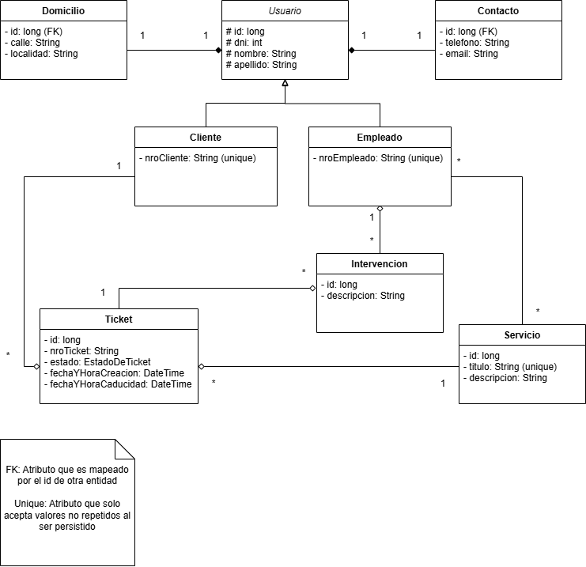

# Sistema de Tickets

## Índice
* [Acerca del proyecto](#acerca-del-proyecto)
  * [Diseños y estructura](#diseños-y-estructura)
  * [Autores](#autores)
* [Instrucciones para compilar](#instrucciones-para-compilar)
* [Instrucciones para colaborar](#instrucciones-para-colaborar)

## Acerca del proyecto
Esta aplicación web es un sistema genérico diseñado para la gestión y el control eficaz de tickets.
Su objetivo es facilitar tanto la apertura de tickets así como el seguimiento y resolución de las solicitudes.

### Diseños y estructura
El siguiente diagrama de clases representa las relaciones entre las entidades del sistema:



Dado que se utiliza Spring Data JPA, las relaciones entre tablas son similares a las indicadas en el diagrama de 
clases. Sin embargo, físicamente son diferentes y por ello no se recomienda realizar operaciones CRUD 
usando scripts de SQL.

Se utiliza un patrón de diseño MVC para la división de capas de la aplicación:
* Controllers para enrutar solicitudes a los models y views.
* Services para la lógica de negocio.
* Repositories para la lógica del acceso a datos.
* Entities para representar tablas de la base de datos
* Models y DTOs para enviar información parcial de los datos

Los casos de uso de la aplicación se encuentran en este
[documento](https://drive.google.com/file/d/14O8tvx2L1XSVL6qsfe8PM0QxcPJggJdA/view?usp=sharing).

### Autores
* Joel Darío Fernández ([JoelFnz](https://github.com/JoelFnz))
* Diego Aguirre ([diegoaguirre992](https://github.com/diegoaguirre992))

## Instrucciones para compilar

Antes de poder compilar el proyecto hay una serie de pre-requisitos que se deben cumplir:
1. Tener JDK versión 17 o superior.
2. Tener Maven instalado o un IDE que lo tenga integrado, como Intellij o Eclipse.
3. Tener MySQL Community Server instalado.
4. Agregar las siguiente variables de entorno:
   * DB_URL -> jdbc:mysql://[host]:[puerto]/[nombre_de_la_base_de_datos]
   * DB_USERNAME -> Algún usuario registrado en la base de datos
   * DB_PASSWORD -> Contraseña del usuario de la base de datos
   * PORT -> Un puerto utilizable para hostear la aplicación. Si no se asigna un valor se utilizará el puerto 8080

Una vez cumplido lo anterior, ejecutar en la consola los siguientes comandos:
```bash
cd tu-ruta-al-directorio-base-del-proyecto

mvn spring-boot:run
```
Si no ocurre ningún fallo, la aplicación estará levantada y podrá ser accedida localmente desde el navegador.

## Instrucciones para colaborar

Recomiendo Intellij IDEA o Spring tools como IDE, aunque cualquier otro puede ser utilizado sin problemas. Tan solo
tener en cuenta que los archivos autogenerados por el IDE deben ser incluidos en .gitignore.

Antes de comenzar a implementar un caso de uso, crear una nueva rama llamada 'feature/[tu-caso-de-uso]' y commitear allí.
De esta manera evitamos que haya conflictos en el hipotético caso de que 2 personas quieran pushear diferentes versiones.

Los nombres de las clases y los métodos deben ser en español, aunque un poco de spanglish viene bien. Tan solo no abusarse.

Evitar commits grandes. Si un commit agrega muchos archivos con diferentes funciones, particionarlo en 2 o más commits.

Para mayor claridad es mejor usar las palabras 'Añado', 'Modifico', 'Elimino' o 'Arreglo' en las descripciones de los 
commits.

Una vez terminado tu caso de uso, no mergear directamente en el main. En su lugar, abrir un pull request desde la página
de github y esperar 1 o 2 días antes de mergear. De esta forma podemos revisar el código, detectar errores o posibles mejoras
y aplicar los cambios antes. Si transcurrido el tiempo no se solicita ningún cambio, entonces podés mergear sin problemas.

Para los HTML es recomendable usar th:replace y th:fragments para reutilizar componentes y evitar archivos muy grandes.
[Acá](https://github.com/JoelFnz/sistema-de-tickets/commit/13154299191fda8150b9f22bcef7f48a80301771#diff-dce5037ca59f91a501819f7f56f1c6c1425519e96cb2fdde9c7dbce971c179e9) 
hay un ejemplo de th:replace.

Por último, mucha suerte y dale que aprobamos el final!